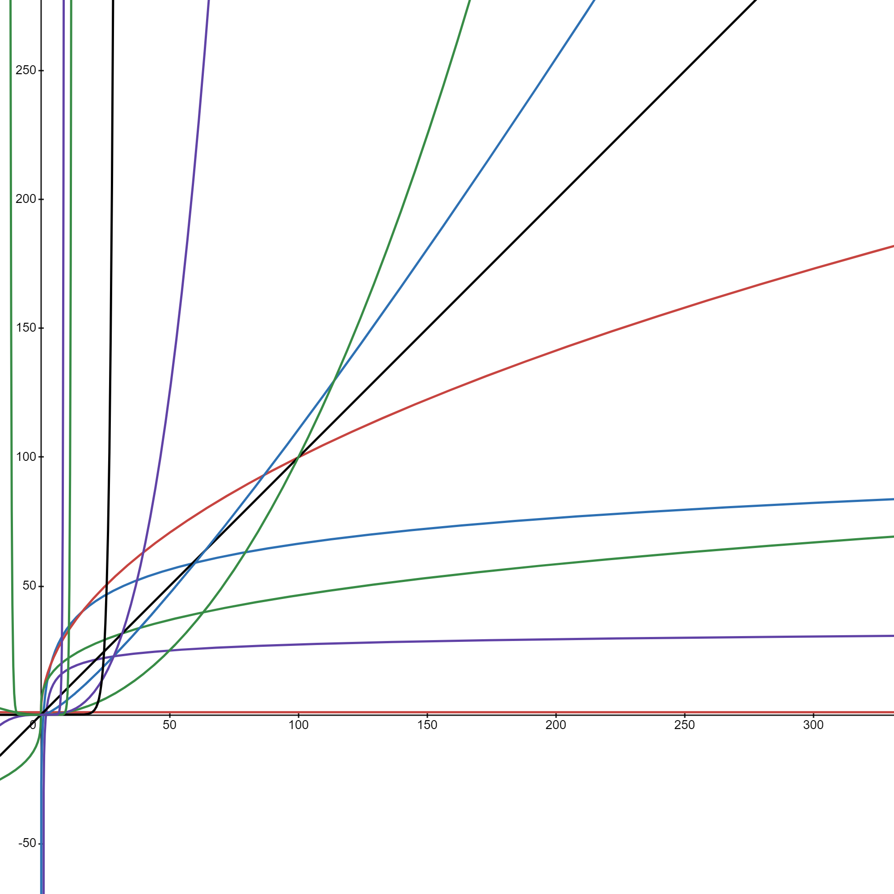
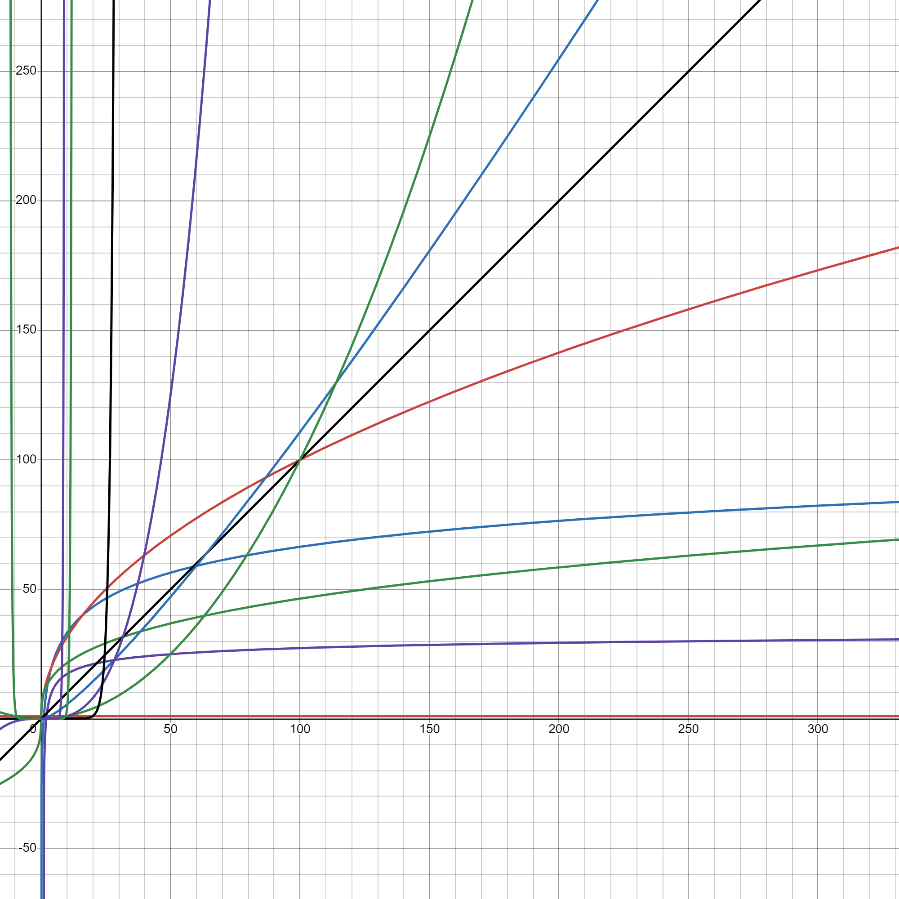

# **Understanding Complexity:**

**Best Worst Case Scenario to Worse Worst Case Scenario:**

_If it makes any sense at all..._

| **S.No.** | **Complexity** | **Equation**                  |
| --------- | -------------- | ----------------------------- |
| 1         | O(1)           | `y = 1`                       |
| 2         | O(log(log(n))) | `y = log(log(n))`             |
| 3         | O(log(n))      | `y = log(n)`                  |
| 4         | O(n^(1/3))     | `y = cubeRoot(n) = n^(1/3)`   |
| 5         | O(n^(1/2))     | `y = squareRoot(n) = n^(1/2)` |
| 6         | O(n)           | `y = n`                       |
| 7         | O(n(log(n)))   | `y = n(log(n))`               |
| 8         | O(n^2)         | `y = n^2`                     |
| 9         | O(n^3)         | `y = n^3`                     |
| 10        | O(2^n)         | `y = 2^n`                     |
| 11        | O(n!)          | `y = n!`                      |
| 12        | O(n^n)         | `y = n^n`                     |

_These are the most commonly used in the programming world._

## Complexity Graph Without Grids

## Complexity Graph Without Grids

Created with ❤️ by Ayush Singh

